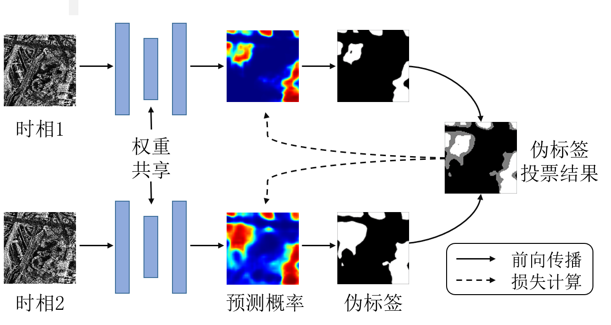

# Edge-Aware Semi-Supervised Built-Up Area Extraction Using Multi-Temporal SAR Images

Code of the paper

This code is based on [MMSegmentation v0.25.0](https://github.com/open-mmlab/mmsegmentation/tree/v0.25.0) framework. Please follow its guidelines to install and use the code.

## Abstract
Extracting built-up areas from SAR images is a critical task in radar remote sensing. The main
difficulties arise from the intrinsic speckle noise and severe geometric distortions in SAR images, coupled with the complex structure and scattering characteristics of the built-up area, which make it difficult to discriminate and label built-up areas in SAR images. To this end, this paper (1) suggests to use of multi-temporal SAR images as a natural data augmentation to improve the quality of pseudo-labeling in semi-supervised learning; (2) designs an edge enhancement aid module to guide the network to predict more precise edges of the built-up
areas. In addition, to validate the proposed method, a multi-temporal SAR image built-up area extraction dataset containing different sensors and urban areas is constructed. Experimental results show that the proposed method can effectively improve the performance of built-up area extraction. Notably, the proposed method using only 10% of labeled data can achieve a comparable accuracy with the competitor using 100% labeled data



## Usage
### Train
```bash
python tools/train.py configs/dbes_tps/dbes_tps_hr18_512_100e_sar_sup_all.py
```


### Test
```bash
python tools/test.py ${checkpoint_path} --show-dir show_dir --eval mIoU
```

## Dataset
The dataset (in .png format, uint8) can be downloaded from [here](
https://xnjdxb.swjtu.edu.cn/news_list.htm?column=shujuji)

## Citation
```bibtex
@article{edgechen, 
    author = {陈帅霖,杨文,李恒超,TAPETE Deodato & BALZ Timo}, 
    title = {顾及边缘的多时相SAR图像半监督建筑区提取}, 
    journal = {西南交通大学学报}, 
    volume = {}, 
    number = {}, 
    year = {}, 
    issn = {0258-2724}, 
    doi ={} }
```