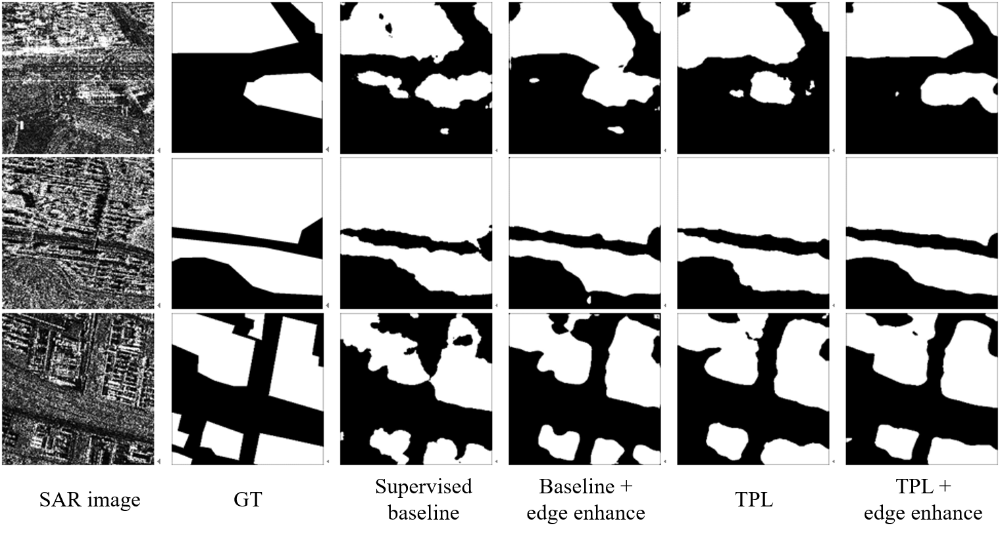

# Mutli-Temporal Pseudo Labelding (TPL)
Mutli-temporal pseudo labelding (TPL) for SAR image building extraction.

This code is based on [MMSegmentation](https://github.com/open-mmlab/mmsegmentation) framework.

sample images:

The full code is on the way...